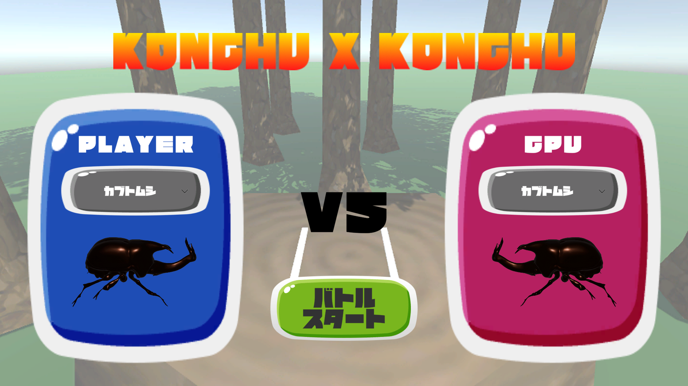
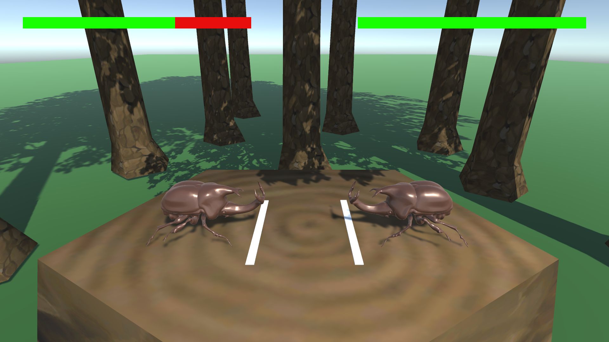
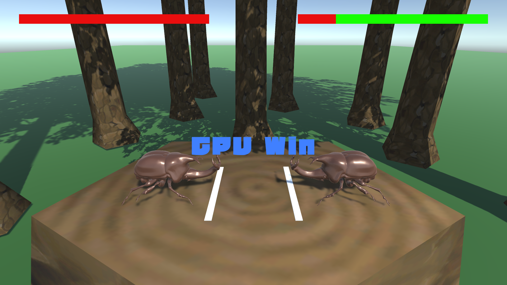

# Konchu X Konchu

## 概要
「昆虫バトル x 押し相撲」をテーマにして、「子供でも楽しめる」「見ている人も楽しめる」を
テーマに作成中のゲームです。

昆虫バトルをテーマにコントローラーを振るという単純かつ直感的な操作で、攻撃でき、避けるアクションで駆け引きが生まれ、子供も楽しめます。
また、コントローラーを振るというダイナミックな動きは見ている人も楽しむことができます。

## プレイイメージ
### スタート画面

### バトル画面

### リザルト画面


---

## 実行方法・操作方法
実行ファイル/KonchuXKonchu.exe を起動

1. キャラクター名をクリックして、プレイヤーのキャラクターを選択
1. キャラクター名をクリックして、CPUのキャラクターを選択
1. 攻撃方法：
    1. カブトムシ：左コントローラを上に振ります。

    1. クワガタ：両方のコントローラを左右から挟む動きに振ります。
1. 避け方法：キャラクターに寄らずコントローラを引くことで避けます。
    ※避けが成功したら次回の攻撃が強くなります。

---

## 技術スタック

| 項目                  | 内容                                |
|----------------------|-------------------------------------|
| エンジン             | Unity 2021.3.8f1                     |
| 言語                 | C#                                   |
| 対応プラットフォーム | Windows                               |

---

## 担当範囲
- すべて担当

---

## 製作期間
- 2022/09/27  作成開始
- 現在  制作中

---

## ソースコード
[github](https://github.com/enbas0721/KonchuXKonchu)

---

## コメント・工夫した点
### 設計観点

昆虫キャラクター（カブトムシ、クワガタ）のHPやアニメーションを制御するための親クラスInsectControllerBaseとJoyconもしくはCPUの入力を受け付けるInputProviderを作成しました。
この実装を分けることによりそれぞれの昆虫キャラクターのHP、アニメーション制御のUIや見た目、サウンドの管理をInsectControllerに集約することができ、HP制御や攻撃・避け時のアニメーション遷移のトリガ判定はInputProviderに集約できています。これにより、CPUInputProviderのように自動でトリガを出すスクリプトを作成することで昆虫キャラクタの種類ごとにCPU用スクリプトを作成するのではなく、一つのスクリプトでCPUを制御することができています。

### 実装観点
攻撃や避けのトリガを出す（入力判定）スクリプト KabutoJoyconInputProvider/KuwagataJoyconProviderの実装を工夫しました。
これらはJoyconのXYZ座標の加速度を取得し、それぞれの昆虫種類に適した判定方法で攻撃・避けトリガを発生させます。

下記に、クワガタキャラクターの入力判定部のスクリプトを抜粋して順序ごとに説明します。
1. 入力受付状態か判定します。
1. Joyconが接続されているかを判定し、接続されていなければ通常状態として値を返します。
1. Joycon R/L の現在の加速度を取得し、Unityの座標系にリマッピングします。（理解しやすいため）
1. クワガタの攻撃時に必要な座標軸の加速度を取得します。(swing_accelR/L, X軸)
1. 右コントローラのx軸の加速度（swing_accelR）と逆側の加速度(swing_accelL)が閾値(accel_threshold_attack)以上であるかどうかを判定します。
1. 判定結果(closing)がtrueであり、かつ、attack_issuedがfalseの場合にattack_eventが発行され、次フレームで攻撃を行うようにトリガを返します。
1. 判定結果(closing)がfalseであれば、attack_issuedがfalseになります。このattack_issuedは攻撃イベントがフレームにまたがって連続で発行されることを防ぐためにあります。
例えば昆虫のアニメーションの時間よりも長くコントローラーを振っている場合などに一回の振るモーションに対して連続で2回攻撃イベントがトリガされる場合があります。これを防ぐためにclosing中でなくなった時にattack_issuedをfalseにして武装解除するようにしています。
1. 右コントローラのz軸の加速度と逆側のz軸の加速度が閾値(accel_threshold_dodge)以上であるかどうかを判定します。
1. 避け時のトリガ判定の以降の処理は攻撃時と同様です。

※この実装では、攻撃と避けのイベントが同時に発行される場合があります。この場合、InsectController側で攻撃イベントが優先され、イベントが同時に実行されることはありません。
このスクリプトでは入力をありのままに返却し、優先度の調停はInsectControllerで行うべきであるという設計方針となっています。

コントローラーの加速度を取得し、それがUnityEditor上で設定したthreshold以上であるかどうかからトリガ判定を行っています。また、attack/dodge_issuedを使用してトリガの誤判定を防いでいます。

以上の実装により、コントローラの振りとゲーム内の昆虫の動作が直感的に接続され、スムーズな操作を可能としています。

```C#:KuwagataJoyconInputProvider.cs
public InsectInput GetInput()
    {
        if (!isEnabled) return default;
        if (m_joyconL == null || m_joyconR == null) return default;

        var accel_R = MapAccel(m_joyconR);
        var accel_L = MapAccel(m_joyconL);

        float swing_accelR = accel_R.x;
        float swing_accelL = accel_L.x;

        bool closing = (((-1) * swing_accelR) >= accel_threshold) && 
                        (swing_accelL >= accel_threshold);

        bool attack_event = false;

        /* Attack */
        if (closing)
        {

            if (!attack_issued)
            {
                attack_event = true;
                attack_issued = true;
            }
        }
        else
        {
            attack_issued = false;
        }

        /* Dodge */
        bool pulling = (((-1) * accel_R.z) >= accel_threshold_dodge) ||
                       (((-1) * accel_L.z) >= accel_threshold_dodge);

        bool dodge_event = false;

        if (pulling)
        {
            if (!dodge_issued)
            {
                dodge_event = true;
                dodge_issued = true;
            }
        }
        else
        {
            dodge_issued = false;
        }

        return new InsectInput { Attack = attack_event, Dodge = dodge_event };
    }
```

